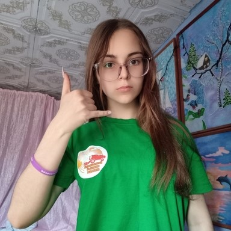
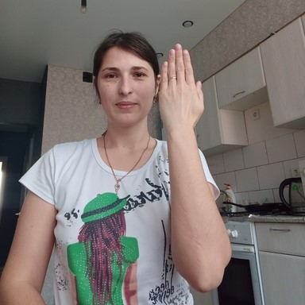

# TensorFlow.js+YOLOX → Unity Tutorial

## Tutorial Links
- [In-Browser Object Detection for Unity with TensorFlow.js](https://christianjmills.com/posts/tfjs-yolox-unity-tutorial/): Create a TensorFlow.js plugin for the Unity game engine to perform object detection with a YOLOX model. 

## In-Browser Demo

| GitHub Repository    | Demo Link      |
| --------------------------------- | ------------------------------------------------------------ |
| [hand-gesture-detector-webgl-demo](https://github.com/cj-mills/hand-gesture-detector-webgl-demo) | [Hand Gesture Detector](https://cj-mills.github.io/hand-gesture-detector-webgl-demo/) |

## Model Conversion Code
| Jupyter Notebook             | Colab                                                        | Kaggle                                                       |
| --------------------------------- | ------------------------------------------------------------ | ------------------------------------------------------------ |
| [GitHub Repository](https://github.com/cj-mills/tfjs-yolox-unity-tutorial/blob/main/notebooks/ONNX-to-TF-to-TFJS.ipynb) | [Open In Colab](https://colab.research.google.com/github/cj-mills/tfjs-yolox-unity-tutorial/blob/main/notebooks/ONNX-to-TF-to-TFJS-Colab.ipynb) | [Open in Kaggle](https://kaggle.com/kernels/welcome?src=https://github.com/cj-mills/tfjs-yolox-unity-tutorial/blob/main/notebooks/ONNX-to-TF-to-TFJS-Kaggle.ipynb) |

<h2>Reference Images</h2>
 

| Class    | Image                                              |
| --------- | ------------------------------------------------------------ |
| call    |  |
| dislike         |  |
| fist    |  |
| four         |  |
| like         |  |
| mute         |  |
| ok    |  |
| one         |  |
| palm         |  |
| peace         |  |
| peace_inverted         |  |
| rock         |  |
| stop         |  |
| stop_inverted         |  |
| three         |  |
| three2         |  |
| two_up         |  |
| two_up_inverted         |  |

